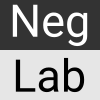
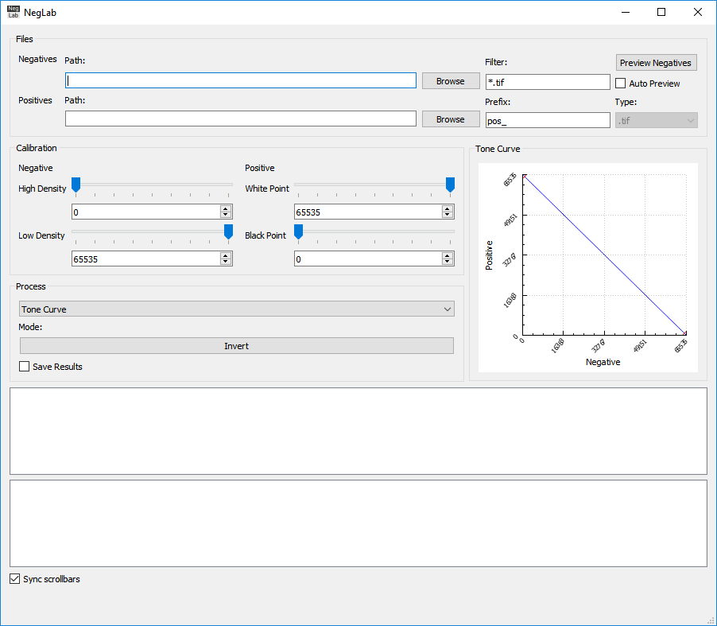
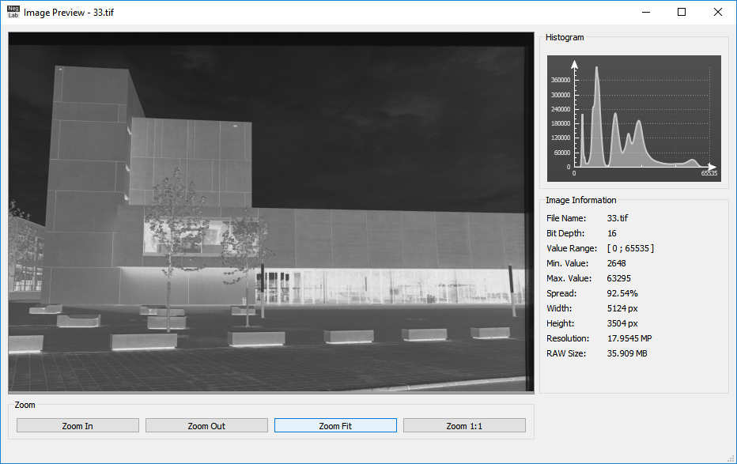
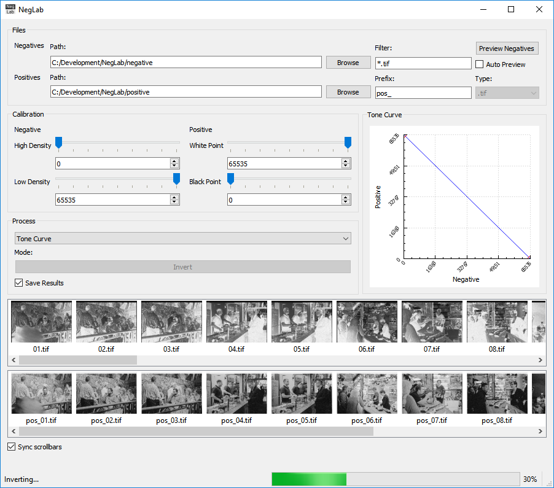

# NegLab

## Overview
**NegLab** is an easy-to-use GUI tool for inverting 16-bit negative scans as produced by the commonly used *SilverFast* scanning software. The tool integrates into a modern digital development process of analog negatives:

**Scan Software ==> 16-bit HDR TIFF / Negative ==> NegLab ==> 16-bit Positive ==> Adobe Lightroom** 

The resulting 16-bit TIFF image can be processed by digital photo editing programs, such as *Adobe Photoshop Lightroom* or *Apple Aperture*. This helps to create high quality scans with the same process as your digital RAW files.

### Features:
- 16-bit monochrome image inversion (48-bit RGB is planned)
- Bitwise-not and tone-curve operator
- Batch processing of whole analog films
- Image preview view

Download the [latest release](https://github.com/lmeinel/NegLab/releases).

## Build NegLab
This repository is prepared to be easily built under Windows with <a href="https://visualstudio.microsoft.com/downloads/" target="_blank">Visual Studio 2017 Compiler</a> using Qt Creator.

### Pre-built Dependencies
This repository includes the following pre-built libraries within the `third_party` folder:
- OpenCV 3.4.0 (MSVC 2017 64-bit or MinGW 5.3.0 32-bit)
- ExifTool 10.24 (C++ Interface for ExifTool)

### Additional Dependencies
Install the latest version of Qt from: https://www.qt.io/download

Select the following components:
- MSVC 2017 64-bit or MinGW 5.3.0 32-bit Pre-built Components
- Qt Charts
- Qt Data Visualization

### Debugger
If you wish to use MSCV 2017 debugger together with QtCreator install the "Debugging Tools for Windows" from the <a href="https://developer.microsoft.com/en-us/windows/downloads/sdk-archive" target="_blank">Windows SDK</a>.

### Make Install
In order to copy all necessary dependencies (DLL files) to the build folder automatically, add a custom build step in the project settings and type `install` into the make arguments field.

## Use NegLab
After start the user is presented with the main window:

Browse a folder containing your negative images and click preview to load the images into memory.
Click on one of the thumbnail images to show a preview of the image:

Click "Invert" to start the inversion process. When "Save Results" is selected the inverted images will be stored in the selected positives folder:

